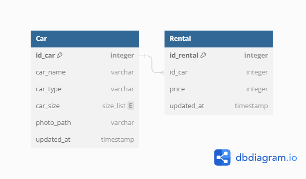

# Challenge-4-Binar-Academy-

Sebuah repository challenge 4 Binar Academy
 

<h5>Relasi Database</h5>

  

<h5>Route path page & API</h5>
<h5>Dashboard page</5>

/dashboard (GET)

<h5>insert car page</5>

/dashboard/create (GET)

<h5>insert car API</5>

/v1/car/create (GET)

<h5>update car API</5>

/v1/car/:id_car (PUT)

<h5>deleted car API</5>

/v1/car/:id_car (deleted)

